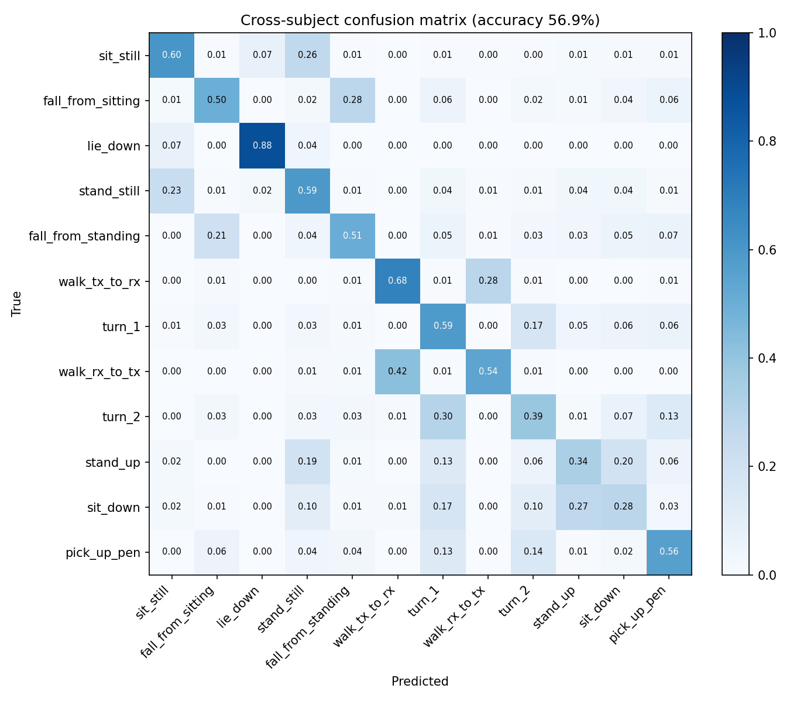

# Wi-Fi CSI Human Activity Recognition

[](https://github.com/baalsaify/wifi-csi-har/actions/workflows/ci.yml)

Recognize what a person is doing (walking, falling, sitting down, picking up a pen, ...) from the
**Channel State Information (CSI)** of ordinary Wi-Fi signals, with no camera or wearable.
This repo is an end-to-end, production-style pipeline:

**raw CSI CSV → signal preprocessing → 1D-CNN (PyTorch) → leakage-free cross-subject evaluation → REST API (FastAPI) → Docker image → CI on every push (GitHub Actions).**

```
 Mendeley Data (CC BY 4.0)          src/csi_har/
 30 subjects × 3 rooms        ┌──────────────────────────────────────────────┐
 9,000 trial CSVs ──download──▶ reader.py   parse "a+bi" CSI, 1×3×30 streams │
                              │ preprocess  |CSI| → Hampel → low-pass 20 Hz  │
                              │             → resample 256 → z-score         │
                              │ models/cnn  4-block 1D-CNN, ~0.2 M params    │
                              │ train.py    5-fold GroupKFold by subject     │
                              │ api/main.py FastAPI /predict, /predict/file  │
                              └───────────────┬──────────────────────────────┘
                                              ▼
                                Docker image ── GitHub Actions: lint → pytest → build → smoke test
```

## Results (cross-subject)

5-fold cross-validation, **grouped by subject**: every test fold contains only people the model
never saw during training. 12 activity classes, 9,000 trials, CPU training (~11 s/epoch).
Numbers come straight from [`reports/metrics.json`](reports/metrics.json).

| Metric | Value |
|---|---|
| Accuracy (mean ± std over 5 folds) | **56.9% ± 3.6%** (chance = 8.3%) |
| Macro-F1 (mean ± std) | **0.52 ± 0.05** |
| Accuracy, LOS room E1 / LOS room E2 / NLOS E3 | 56.8% / 57.1% / 56.8% |
| Accuracy if the two "falling" and the two "turning" labels are merged | 63.3% |



**What the errors say.** The best-recognized class is `lie_down` (F1 0.89). Most mistakes are
between *mirror-image* pairs: `sit_still` ↔ `stand_still`, `walk_tx_to_rx` ↔ `walk_rx_to_tx`,
`sit_down` ↔ `stand_up`, and the two falls and two turns. That is expected from this design.
The model sees only per-trial-normalized CSI **amplitude**, which removes absolute signal level
(static postures) and carries little information about motion **direction**. Accuracy is the same
in the non-line-of-sight setup as in the two line-of-sight rooms.

**Next steps that target exactly these errors:** add CSI phase (sanitized phase differences
between antennas) or Doppler spectrograms to capture direction; keep absolute amplitude level
for static postures; and model the experiment sequence (e.g. `sit_still → fall → lie_down`) with
a sequence model over consecutive segments.

## Dataset

**A dataset for Wi-Fi-based human activity recognition in line-of-sight and non-line-of-sight indoor
environments** (B. A. Alsaify, M. M. Almazari, R. Alazrai, M. I. Daoud). Mendeley Data, V1,
[doi:10.17632/v38wjmz6f6.1](https://doi.org/10.17632/v38wjmz6f6.1), licensed **CC BY 4.0**.
Paper: *Data in Brief* 33 (2020) 106534, [doi:10.1016/j.dib.2020.106534](https://doi.org/10.1016/j.dib.2020.106534).

- Intel 5300 NICs, 2.4 GHz channel 3, 20 MHz, 320 packets/s, 1 TX × 3 RX antennas, 30 subcarriers → **90 CSI streams**
- 3 environments: two line-of-sight rooms (E1, E2) and one non-line-of-sight setup (E3); 10 subjects each
- 5 experiments split into 12 labeled activities, 20 trials each → **9,000 trial files**

| Code | Label | Activity (paper, Table 1) | Experiment |
|---|---|---|---|
| A1 | `sit_still` | Sit still on a chair | C1, C4 |
| A2 | `fall_from_sitting` | Falling down | C1 (falling from sitting) |
| A3 | `lie_down` | Lie down | C1, C2 |
| A4 | `stand_still` | Stand still | C2, C4 |
| A5 | `fall_from_standing` | Falling down | C2 (falling from standing) |
| A6 | `walk_tx_to_rx` | Walking from transmitter to receiver | C3 |
| A7 | `turn_1` | Turning | C3 |
| A8 | `walk_rx_to_tx` | Walking from receiver to transmitter | C3 |
| A9 | `turn_2` | Turning | C3 |
| A10 | `stand_up` | Standing up | C4 |
| A11 | `sit_down` | Sitting down | C4 |
| A12 | `pick_up_pen` | Pick a pen from the ground | C5 |

The data is **not** stored in this repo; the download script fetches it from Mendeley and verifies
every file against its published SHA-256.

## Quickstart

```bash
python -m venv .venv && source .venv/bin/activate        # Windows: .venv\Scripts\activate
pip install --index-url https://download.pytorch.org/whl/cpu torch
pip install -e ".[dev]"

python -m csi_har.data.download --out data/raw           # ~2.1 GB, resumable, checksum-verified
python -m csi_har.data.dataset --raw data/raw --out data/processed.npz
python -m csi_har.train --data data/processed.npz        # writes reports/ and models/har_cnn.pt
pytest                                                   # unit + API tests (no dataset needed)
```

## REST API

```bash
uvicorn csi_har.api.main:app --reload          # interactive docs at http://127.0.0.1:8000/docs
```

| Method | Path | Purpose |
|---|---|---|
| GET | `/health` | Liveness and whether the model is loaded |
| GET | `/model-info` | Activity classes, input contract, cross-validation summary |
| POST | `/predict` | JSON body `{"csi_amplitude": [[90 floats], ...]}` (≥ 32 packets) |
| POST | `/predict/file` | Upload one raw trial CSV from the dataset |

```bash
# A "lie down" trial from subject 20, one of the subjects held out from the served model's training
curl -F "file=@E2_S20_C01_A03_T01.csv" http://127.0.0.1:8000/predict/file
# {"activity":"lie_down","activity_code":"A3","confidence":0.958,"probabilities":{"sit_still":0.0067, ...}}
```

`lie_down` is the easiest class; on unseen people the model is right about 57% of the time
overall (see Results), so expect confident mistakes on the mirror-image pairs.

Inputs are validated (shape, packet count, finite values) and rejected with HTTP 422; uploads over
5 MB get HTTP 413; a missing model returns HTTP 503 instead of crashing.

## Docker

```bash
docker build -t wifi-csi-har .
docker run -p 8000:8000 wifi-csi-har
```

The image uses CPU-only PyTorch, runs as a non-root user, and has a container `HEALTHCHECK`.
CI builds this image on every push and smoke-tests `/health`, `/model-info` and `/predict` inside
the running container.

## Design notes

- **Evaluation without leakage.** Activity-recognition results are easy to inflate by letting
  trials from the same person appear in training and test sets. Here, every fold tests on
  subjects the model has never seen (`GroupKFold` by subject), and early stopping uses a separate
  set of validation subjects, never the test fold. `tests/test_splits.py` enforces this.
- **Preprocessing.** CSI amplitude is cleaned with a Hampel filter (spike removal), a zero-phase
  4th-order Butterworth low-pass at 20 Hz (human motion is well below this), linearly resampled
  to 256 steps, and z-scored per stream so the model sees shape, not absolute signal level.
- **Model.** Four Conv1d–BatchNorm–ReLU blocks with global average pooling (any input length
  works), dropout, AdamW, cosine learning-rate schedule, label smoothing, and light gain/jitter
  augmentation. Small enough (< 1 MB) to ship inside the Docker image and run on CPU.
- **Parser.** A vectorized NumPy parser converts the dataset's `a+bi` text format to complex
  arrays (~0.1 s per trial), reading straight from the downloaded zips without extracting them.

## Project layout

```
src/csi_har/
  config.py          dataset constants, activity labels, hyperparameters
  data/download.py   Mendeley public-API downloader (SHA-256 verified, resumable)
  data/reader.py     trial CSV parser and file-name metadata
  data/dataset.py    parallel preprocessing into a cached .npz
  preprocess.py      Hampel, low-pass, resampling, z-score
  splits.py          cross-subject folds
  models/cnn.py      1D-CNN
  train.py           training, evaluation, final model export
  evaluate.py        metrics and confusion-matrix plot
  inference.py       model loading and prediction
  api/main.py        FastAPI service
tests/               pytest suite (parser, preprocessing, splits, model, API)
```

## Related publications

- B. A. Alsaify et al., "A CSI-Based Multi-Environment Human Activity Recognition Framework," *Applied Sciences*, 12(2), 930, 2022.
- B. A. Alsaify et al., "WiFi Signals for Passive Human Identification: A Study of Three Activities," *IEEE Access*, 12, 113087–113098, 2024.
- B. A. Alsaify et al., "Exploiting Wi-Fi Signals for Human Activity Recognition," ICICS 2021.

## License

Code: MIT (see `LICENSE`). Dataset: CC BY 4.0, by its authors; not redistributed here.
